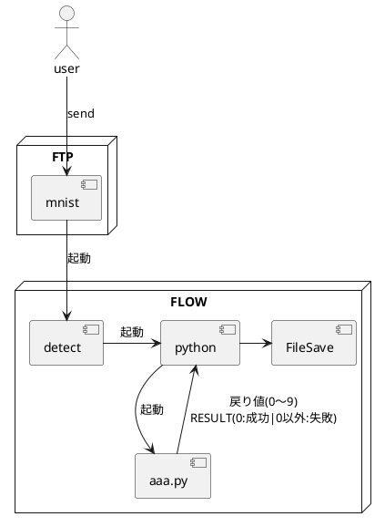

# System Overview

システムの概要を下図に示します。

```plantuml
@startuml
actor user

node "FTP"{
     user --> [mnist] : send

}

node "FLOW"{
    [mnist] --> [detect] : 起動
    [detect]-right->[python] : 起動
    [python]-down->[aaa.py] : 起動
    [aaa.py]-up->[python] : 戻り値(0～9)\nRESULT(0:成功|0以外:失敗)
    [python]-right-> [FileSave]
}
@enduml
```
